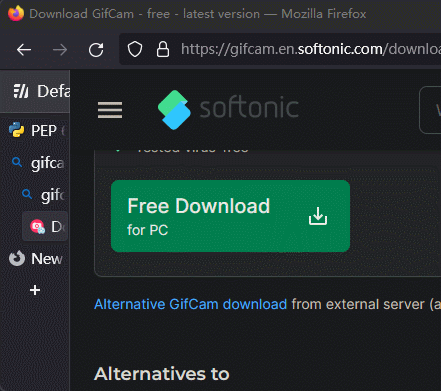
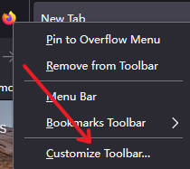
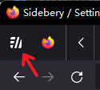
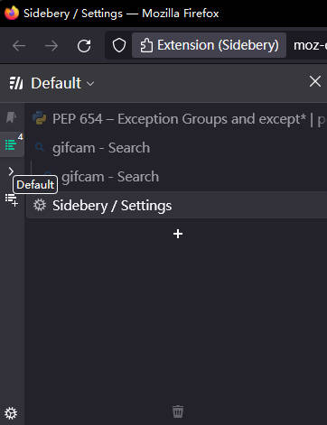

文本在 Firefox 上，实现了 MS Edge 垂直标签页的效果，树状标签页扩展用的是 Sidebery，通过配合自定义浏览器样式，优化了出自己想要的效果：



## 扩展安装

Firefox 扩展商店里的树状标签页扩展不止一个，本人是在比较后，选择了感觉上较为先进的 Sidebery。

本文基于扩展的 V5 Beta 版本，（这个扩展在商店里的版本是 V4 的，有些好用的功能还不支持），安装这个版本需要访问作者的 [GitHub](https://github.com/mbnuqw/sidebery) 主页，可以直接[点此安装 v5.0.0b31 版本](https://github.com/mbnuqw/sidebery/releases/download/v5.0.0b31/sidebery-5.0.0b31.xpi)。

安装后，你的 Firefox 左侧应该就会显示出树状标签页了，但是这个标签页只有在点击扩展图标后才会显示，且界面操作之类体验，相比较 Edge 是有差距的。

**下面会介绍我怎么把他打造成演示的样子。**

## 浏览器配置

为了实现目的，下面需要修改一些设置。

首先右键 Firefox 的工具栏，点击最底下那个定制工具栏（Customize Toolbar）：



然后左下角勾选标题栏（Title Bar）后点击保存，让标题栏显示出来，这样配置后更加好看一些。


为了让 Firefox 支持自定义样式，先访问 `about:config` 然后搜索并将 `toolkit.legacyUserProfileCustomizations.stylesheets` 选项设置为 true。

Window + R 打开运行框，输入 `%appdata%\Mozilla\Firefox\Profiles` 打开 Firefox 存放 Profiles 的目录， 找到并进入到你的浏览器 profile 文件夹（比如说 `xxx.default-release`）。

> 如果只装了一个 Firefox 版本，且没有自己新建 Profile，那应该 Profiles 目录下应该只有一个文件夹。

在这个 `xxx.default-release` 文件夹下，新建 `chrome` 文件夹，并新建一个名为 `userChrome.css` 的文件，马上会编辑到。

> 介绍的操作方式是 Windows 上的，对于 Liunx 的同学，我相信看了以后能无师自通，就不过多介绍了。

## 自动隐藏默认标签栏

首先我希望在树状标签页显示的时候，不要显示 Firefox 原生的横向标签页，这样整个界面就能简洁了。

首先打开扩展的设置 -> 通用，找到“前言值设置（Preface Value）”，并且把对应的向窗口标题添加前言值的功能启用，在输入框里面输入 `---` 后，左上角的标题栏中的标题会显示出 `---`。

编辑 `userChrome.css` 文件，添加如下的 CSS 样式代码并保存：

```css
#main-window[titlepreface="---"] #TabsToolbar {
  height: 0 !important;
}
#main-window[titlepreface="---"] #tabbrowser-tabs {
  z-index: 0 !important;
}
```

在启用“添加前言值”功能后，扩展就会增加 `titlepreface` 属性，内容就是刚才输入框里输入的 `---`，所以就可以通过使用 CSS 选择器，来进行当前是否打开了树状标签页。

重启浏览器后就能发现，只要树状标签页开着，默认的横向标签栏就不会显示了。


刚才提到这样设置后，左上角的标题栏中的标题前，会增加我们设置的前言值，那么为了更加美观，我们可以把值设置成一串不可见的字符（毕竟主要目的只是用于判断嘛）：

```
‌‌‌​‌‌​‍‌‌​‌​‍‌‌‌​‌​‌‍‌​‍‌‍‍
```

然后同样编辑 `userChrome.css` 文件，替换内容以调整效果：

```css
#main-window[titlepreface="‌‌‌​‌‌​‍‌‌​‌​‍‌‌‌​‌​‌‍‌​‍‌‍‍"] #TabsToolbar {
  height: 0 !important;
}
#main-window[titlepreface="‌‌‌​‌‌​‍‌‌​‌​‍‌‌‌​‌​‌‍‌​‍‌‍‍"] #tabbrowser-tabs {
  z-index: 0 !important;
}
```

至此，就实现了当树状标签页显示的时候，不显示默认的横向标签页的效果了。

当显示了树状标签页后，扩展的按钮就没啥用了，毕竟树状标签页这么好用的东西，为什么还要再点按钮关闭呢？不过我不建议直接隐藏这个图标，因为拓展面板的显示是基于 Firefox 侧边栏的，所以有时候会被本身的一些面板替换（如历史面板），于是树状标签页就不显示了，所以我推荐把这个扩展图标放在标签栏中，这样原生和拓展的标签栏就相辅相成了：



## 自动收缩标签页

Edge 的垂直标签页有一个收缩的效果，下面我们也来整一下。

仍然是编辑 `userChrome.css` 文件，向其末尾添加 CSS 代码：

```css
#main-window[titlepreface="‌‌‌​‌‌​‍‌‌​‌​‍‌‌‌​‌​‌‍‌​‍‌‍‍"] #sidebar-box:not() {
  min-width: var(--wide-tab-width) !important;
  max-width: none !important;
}

#main-window[titlepreface="‌‌‌​‌‌​‍‌‌​‌​‍‌‌‌​‌​‌‍‌​‍‌‍‍"] #sidebar-box {
  --thin-tab-width: 70px;
  position: relative !important;
  transition: all 100ms !important;
  min-width: var(--thin-tab-width) !important;
  max-width: var(--thin-tab-width) !important;
}

#main-window[titlepreface="‌‌‌​‌‌​‍‌‌​‌​‍‌‌‌​‌​‌‍‌​‍‌‍‍"] #sidebar-box:hover {
  --wide-tab-width: 370px;
  transition: all 200ms !important;
  min-width: var(--wide-tab-width) !important;
  max-width: var(--wide-tab-width) !important;
  margin-right: calc((var(--wide-tab-width) - var(--thin-tab-width)) * -1) !important;
  z-index: 1;
}
```

这上面主要就是设置了默认的宽度，同时当鼠标移动上去后就增加宽度的效果。

重启浏览器后，如果你多试几次，会发现有个关闭按钮好像挺突兀的，这里再次编辑 `userChrome.css` 文件，向其末尾添加 CSS 代码：

```css
#main-window[titlepreface="‌‌‌​‌‌​‍‌‌​‌​‍‌‌‌​‌​‌‍‌​‍‌‍‍"] #sidebar-box #sidebar-close{
    display:none;
}
#main-window[titlepreface="‌‌‌​‌‌​‍‌‌​‌​‍‌‌‌​‌​‌‍‌​‍‌‍‍"] #sidebar-box:hover #sidebar-close{
    display:unset;
}
```

最后处理一下特殊的情况，比如进入全屏后就不要显示了：

```css
#main-window[inFullscreen] #sidebar-box,
#main-window[inFullscreen] #sidebar-splitter {
  display: none !important;
  width: 0px !important;
}
#main-window[titlepreface="[1] "] #sidebar-box {
  visibility: collapse !important;
}
```


（文末总结放出完整的 `userChrome.css` 文件内容）

## 配置扩展的树状面板

（可选）如果你觉得上面的配置好后，用起来已经很满意了，那就忽略这节即可，当然我还是推荐做一下，可以使得你的体验更佳。

打开 Sidebery 的设置：

1. 菜单（Menu） -> 导航栏（Navigation bar） -> 布局（Layout），选择垂直排列（vertical）。

2. 样式编辑器（Style editor），左上角选择 SideBar（默认的），右侧面板中输入：

   ```css
   #root .NavigationBar {
     display: none;
   }
   
   #root:hover .NavigationBar {
     display: flex;
   }
   
   #root {
     --name-font-size: 12px;
     --count-font-size: 10px;
   }
   
   .NavigationBar .nav-item {
     display: flex;
     flex-direction: column-reverse;
     padding: 6px 0;
     height: auto;
   }
   
   .NavigationBar .main-items .nav-item[data-type="add_tp"] {
     height: var(--nav-btn-width);
   }
   
   .NavigationBar .main-items .nav-item[data-type="settings"] {
     height: var(--nav-btn-width);
   }
   
   .NavigationBar .nav-item:not([data-type="add_tp"]):not([data-type="settings"]) .name {
     position: relative;
     display: block;
     padding: 0;
     margin: 0 2px 0 0;
     font-size: var(--name-font-size);
     color: var(--color, var(--nav-btn-fg));
     writing-mode: sideways-lr;
     text-orientation: mixed;
   }
   
   .NavigationBar .nav-item .update-badge {
     top: 1px;
     left: 1px;
   }
   
   .NavigationBar .nav-item .badge,
   .NavigationBar .nav-item .progress-spinner {
     display: none;
   }
   
   
   .NavigationBar .hidden-panels-popup-layer .nav-item div.name-box {
     display: none;
   }
   ```

至此，就能有一个比较舒服的垂直面板标签的效果了。




## 扩展推荐配置

启用先进的双击标签页关闭功能：

鼠标 -> 标签页操作 -> 双击标签页 -> 选择关闭标签页。


## 总结

 `userChrome.css` 文件：

```css
/* Hide the native toolbar */
#main-window[titlepreface^="‌‌‌​‌‌​‍‌‌​‌​‍‌‌‌​‌​‌‍‌​‍‌‍‍"] #TabsToolbar {
  height: 0 !important;
}
#main-window[titlepreface^="‌‌‌​‌‌​‍‌‌​‌​‍‌‌‌​‌​‌‍‌​‍‌‍‍"] #tabbrowser-tabs {
  z-index: 0 !important;
}

/* Shrink/unshrink sidebar. */
#main-window[titlepreface="‌‌‌​‌‌​‍‌‌​‌​‍‌‌‌​‌​‌‍‌​‍‌‍‍"] #sidebar-box:not() {
    min-width: var(--wide-tab-width) !important;
    max-width: none !important;
}

#main-window[titlepreface="‌‌‌​‌‌​‍‌‌​‌​‍‌‌‌​‌​‌‍‌​‍‌‍‍"] #sidebar-box {
    --thin-tab-width: 70px;
    position: relative !important;
    transition: all 100ms !important;
    min-width: var(--thin-tab-width) !important;
    max-width: var(--thin-tab-width) !important;
}

#main-window[titlepreface="‌‌‌​‌‌​‍‌‌​‌​‍‌‌‌​‌​‌‍‌​‍‌‍‍"] #sidebar-box #sidebar-close{
    display:none;
}
#main-window[titlepreface="‌‌‌​‌‌​‍‌‌​‌​‍‌‌‌​‌​‌‍‌​‍‌‍‍"] #sidebar-box:hover #sidebar-close{
    display:unset;
}

#main-window[titlepreface="‌‌‌​‌‌​‍‌‌​‌​‍‌‌‌​‌​‌‍‌​‍‌‍‍"] #sidebar-box:hover {
    --wide-tab-width: 370px;
    transition: all 200ms !important;
    min-width: var(--wide-tab-width) !important;
    max-width: var(--wide-tab-width) !important;
    margin-right: calc((var(--wide-tab-width) - var(--thin-tab-width)) * -1) !important;
    z-index: 1;
}

#main-window[inFullscreen] #sidebar-box,
#main-window[inFullscreen] #sidebar-splitter {
  display: none !important;
  width: 0px !important;
}
#main-window[titlepreface="[1] "] #sidebar-box {
  visibility: collapse !important;
}
```


Sidebery 导入配置：

```json
{"settings":{"nativeScrollbars":false,"nativeScrollbarsThin":true,"nativeScrollbarsLeft":false,"selWinScreenshots":false,"updateSidebarTitle":true,"markWindow":true,"markWindowPreface":"‌‌‌​‌‌​‍‌‌​‌​‍‌‌‌​‌​‌‍‌​‍‌‍‍","ctxMenuNative":false,"ctxMenuRenderInact":true,"ctxMenuRenderIcons":true,"ctxMenuIgnoreContainers":"","navBarLayout":"vertical","navBarInline":false,"navBarSide":"left","hideAddBtn":false,"hideSettingsBtn":false,"navBtnCount":true,"hideEmptyPanels":true,"navActTabsPanelLeftClickAction":"none","navActBookmarksPanelLeftClickAction":"none","navTabsPanelMidClickAction":"none","navBookmarksPanelMidClickAction":"none","navSwitchPanelsWheel":true,"groupLayout":"grid","skipEmptyPanels":false,"dndTabAct":true,"dndTabActDelay":750,"dndTabActMod":"none","dndExp":"pointer","dndExpDelay":0,"dndExpMod":"none","dndOutside":"win","searchBarMode":"dynamic","warnOnMultiTabClose":"collapsed","activateLastTabOnPanelSwitching":true,"activateLastTabOnPanelSwitchingLoadedOnly":true,"tabRmBtn":"hover","hideInact":false,"activateAfterClosing":"next","activateAfterClosingStayInPanel":false,"activateAfterClosingGlobal":false,"activateAfterClosingNoFolded":true,"activateAfterClosingNoDiscarded":true,"askNewBookmarkPlace":false,"tabsRmUndoNote":true,"nativeHighlight":false,"tabsUnreadMark":false,"tabsUpdateMark":"all","tabsUpdateMarkFirst":true,"tabsReloadLimit":5,"tabsReloadLimitNotif":true,"showNewTabBtns":true,"newTabBarPosition":"after_tabs","tabsPanelSwitchActMove":false,"tabsUrlInTooltip":"full","openSubPanelOnMouseHover":false,"selectActiveTabFirst":true,"moveNewTabPin":"start","moveNewTabParent":"last_child","moveNewTabParentActPanel":false,"moveNewTab":"end","moveNewTabActivePin":"start","pinnedTabsPosition":"panel","pinnedTabsList":false,"pinnedAutoGroup":false,"tabsTree":true,"groupOnOpen":true,"tabsTreeLimit":"none","hideFoldedTabs":false,"hideFoldedParent":"none","autoFoldTabs":false,"autoFoldTabsExcept":"none","autoExpandTabs":false,"rmChildTabs":"none","tabsChildCount":true,"tabsLvlDots":true,"discardFolded":false,"discardFoldedDelay":0,"discardFoldedDelayUnit":"sec","tabsTreeBookmarks":true,"treeRmOutdent":"branch","colorizeTabs":false,"colorizeTabsSrc":"domain","colorizeTabsBranches":false,"colorizeTabsBranchesSrc":"url","inheritCustomColor":true,"warnOnMultiBookmarkDelete":"collapsed","autoCloseBookmarks":false,"autoRemoveOther":false,"highlightOpenBookmarks":false,"activateOpenBookmarkTab":false,"showBookmarkLen":false,"bookmarksRmUndoNote":true,"loadBookmarksOnDemand":true,"pinOpenedBookmarksFolder":true,"loadHistoryOnDemand":true,"fontSize":"m","animations":true,"animationSpeed":"fast","theme":"proton","density":"default","colorScheme":"ff","sidebarCSS":true,"groupCSS":false,"snapNotify":true,"snapExcludePrivate":false,"snapInterval":0,"snapIntervalUnit":"min","snapLimit":0,"snapLimitUnit":"snap","hScrollAction":"none","navSwitchPanelsDelay":128,"scrollThroughTabs":"none","scrollThroughVisibleTabs":false,"scrollThroughTabsSkipDiscarded":false,"scrollThroughTabsExceptOverflow":true,"scrollThroughTabsCyclic":false,"scrollThroughTabsScrollArea":0,"autoMenuMultiSel":true,"multipleMiddleClose":false,"longClickDelay":500,"wheelThreshold":false,"wheelThresholdX":10,"wheelThresholdY":60,"tabDoubleClick":"close","tabsSecondClickActPrev":false,"tabsSecondClickActPrevPanelOnly":false,"shiftSelAct":true,"activateOnMouseUp":true,"tabLongLeftClick":"none","tabLongRightClick":"none","tabCloseMiddleClick":"discard","tabsPanelLeftClickAction":"none","tabsPanelDoubleClickAction":"tab","tabsPanelRightClickAction":"menu","tabsPanelMiddleClickAction":"tab","newTabMiddleClickAction":"new_child","bookmarksLeftClickAction":"open_in_act","bookmarksLeftClickActivate":false,"bookmarksLeftClickPos":"default","bookmarksMidClickAction":"open_in_new","bookmarksMidClickActivate":false,"bookmarksMidClickPos":"default","syncName":"","syncSaveSettings":true,"syncSaveCtxMenu":true,"syncSaveStyles":true,"syncSaveKeybindings":false},"sidebarCSS":"#root .NavigationBar {\n  display: none;\n}\n\n#root:hover .NavigationBar {\n  display: flex;\n}\n\n#root {\n  --name-font-size: 12px;\n  --count-font-size: 10px;\n}\n\n.NavigationBar .nav-item {\n  display: flex;\n  flex-direction: column-reverse;\n  padding: 6px 0;\n  height: auto;\n}\n\n.NavigationBar .main-items .nav-item[data-type=\"add_tp\"] {\n  height: var(--nav-btn-width);\n}\n\n.NavigationBar .main-items .nav-item[data-type=\"settings\"] {\n  height: var(--nav-btn-width);\n}\n\n/* \n.NavigationBar .main-items .nav-item:not([data-type=\"add_tp\"]):not([data-type=\"settings\"]) > svg,\n.NavigationBar .hidden-bar .nav-item > svg,\n.NavigationBar .main-items .nav-item > img {\n  display: none;\n} */\n\n.NavigationBar .nav-item:not([data-type=\"add_tp\"]):not([data-type=\"settings\"]) .name {\n  position: relative;\n  display: block;\n  padding: 0;\n  margin: 0 2px 0 0;\n  font-size: var(--name-font-size);\n  color: var(--color, var(--nav-btn-fg));\n  writing-mode: sideways-lr;\n  text-orientation: mixed;\n}\n\n.NavigationBar .nav-item .update-badge {\n  top: 1px;\n  left: 1px;\n}\n\n.NavigationBar .nav-item .badge,\n.NavigationBar .nav-item .progress-spinner {\n  display: none;\n}\n\n\n.NavigationBar .hidden-panels-popup-layer .nav-item div.name-box {\n  display: none;\n}","groupCSS":"","ver":"5.0.0b31"}
```


​						Have fun！


MKP-TAGS: #firefox #sidebery #edge #vertical-toolbar #tabs
